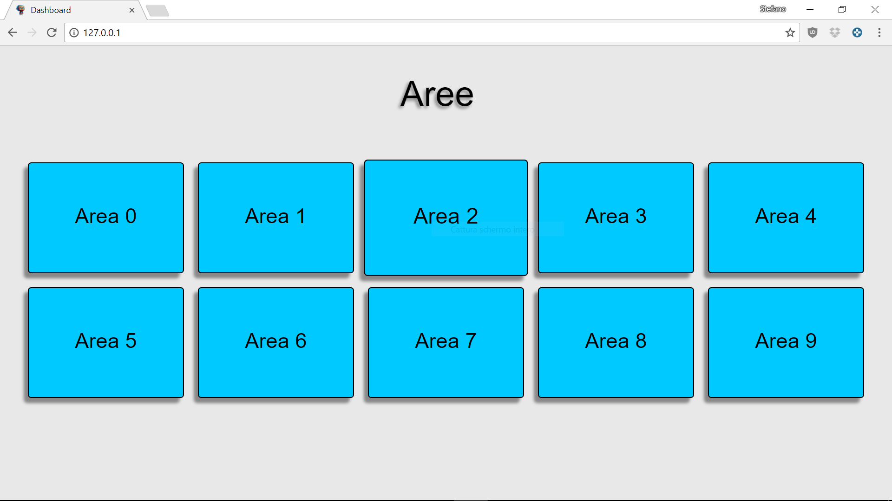
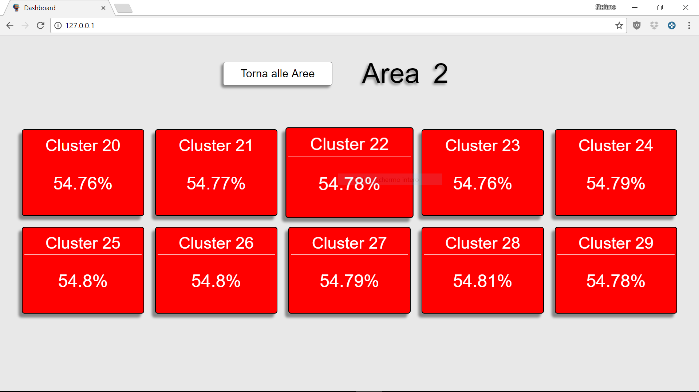
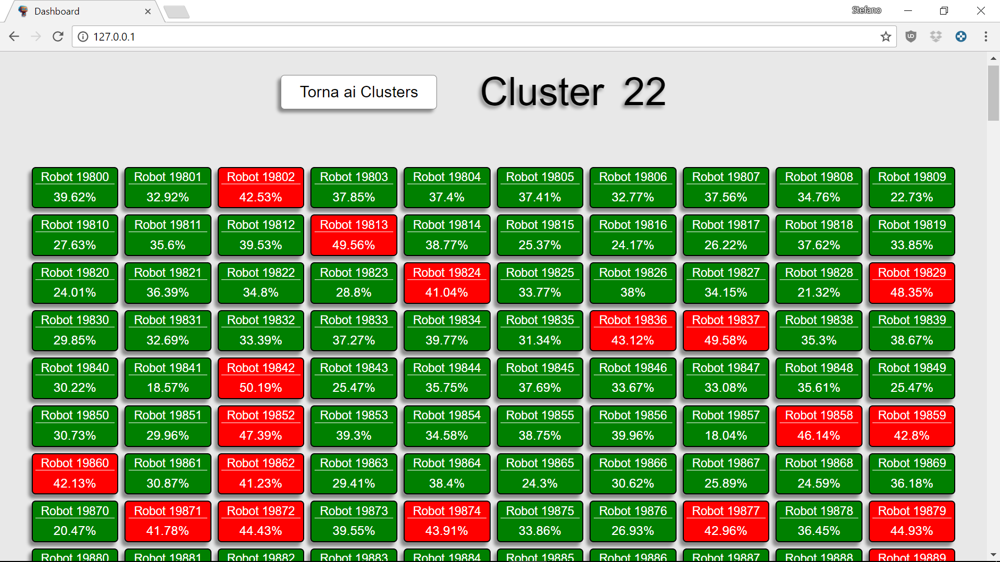

# Dashboard

Project for Software engineering course of [University of L'Aquila](http://univaq.it)

This project has the aim to realize a Dashboard to display robots and clusters IR.
For more information read the [project specific](doc/Progetto_Soft_Eng_2017-2018.pdf).

## Team

- Cupido Giammarco
- Icaro Iari
- Martella Stefano
- Morelli Davide
- Tramontozzi Paolo

## Prerequisites

 - [Java](https://www.java.com/it/download/) to run application (**required**).
 - [MongoDB](https://www.mongodb.com/download-center#community) to make app work with database (**required**).
 - [Apache](https://www.apachefriends.org/it/download.html) to run app on a server (**required**).
 - [Robo 3T](https://robomongo.org/) MongoDB GUI (optional).

## Start using it

  After installing all not optional requirements download or clone this project.
  Now you need to set up the database:

  1. First of all add MongoDB bin path to PATH.
  2. Than you need to start MongoDB service, so open a terminal and run the following command:
     `mongod`
  3. Now open a new shell and run the following command: 
     `mongo`
     than create the database and its collections with:
  ```
  use ir_viewer;
  db.createCollection("robot");
  db.createCollection("cluster");
  ```  
  If you are here the database is ready, now let's set up apache:
  
  1. From project folder you cloned/donwload move on WebContent folder(seAIMgroup\DashboardMongoDB\WebContent) copy all files                except for folders and than paste them into C:\xampp\htdocs (or your XAMPP installation directory).
  2. Open a text editor and edit C:\xampp\apache\conf\httpd.conf file changing:
  ```
  <IfModule dir_module>
     DirectoryIndex index.php index.pl index.cgi index.asp index.shtml index.html index.htm \
                    default.php default.pl default.cgi default.asp default.shtml default.html default.htm \
                    home.php home.pl home.cgi home.asp home.shtml home.html home.htm
   </IfModule>
   ```
     with:
   ```
   <IfModule dir_module>
      DirectoryIndex Dashboard.html
   </IfModule>
   ```
  3. Open XAMPP Control Panel and start apache service.
  
  You're almost ready to start the dashboard, you need to change IP address into Dashboard.js(seAIMgroup\DashboardMongoDB\WebContent)     file as follow:
  ```
  ...
  
  $.getJSON('https://api.ipify.org?format=json', function(data){
		var IP_ADDRESS;
		if( data.ip == "YOUR_PUBLIC_IP" )   // OPTIONAL
			IP_ADDRESS = "YOUR_LOCAL_IP";
		else
			IP_ADDRESS = "YOUR_PUBLIC_IP";
      
  ...
  
  ```
  and in WebSocketServer.java file(seAIMgroup\DashboardMongoDB\src\server\WebsocketServer.java):
  ```
  private final static String IP_ADDRESS = "YOUR_LOCAL_IP";
  ```
  
  Ok everything is ready, let's start the system:
  
  1. If you stopped the MongoDB service restart it again.
  2. If you stopped Apache service restart it again.
  3. Open your favorite IDE, we assume you are using Eclipse, and import the project(DashboardMongoDB), now you probably need to import      libraries so right click on project(DashboardMongoDB) --> build path --> configure build path and add necessary
     external jars(java-json.jar, java-websocket-1.3.0.jar, mongo-java-driver-3.6.1.jar) to project class path, they are located in 	      seAIMgroup\libraries folder.
  4. Browse to model package and run StartSystem.java file, wait 5-10 seconds and than run MessagesSender.java, located in test package,
     to simulate messages sent.
  5. Open your favorite browser, **disable your ad block if you have one**, and on address bar connect to local server, 127.0.0.1.
  6. The Dashboard will be ready in few seconds.
  
  Dashboard aspect:
  
   |  | 
  --- | --- | ---
     
     
